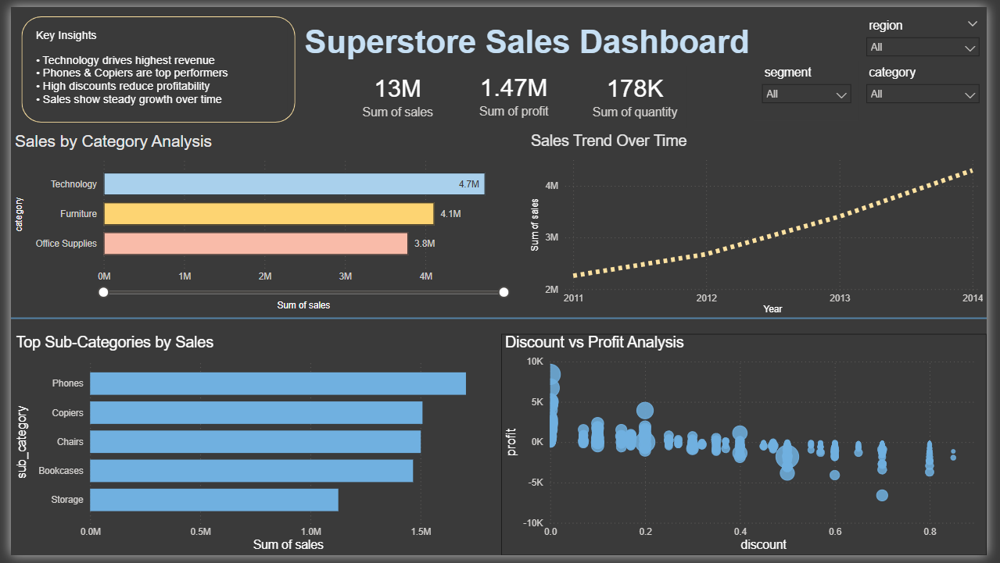

**Superstore Sales Analysis & Dashboard**
      using Python and Power BI
      This project demonstrates end-to-end data analysis and dashboarding skills for business decision-making.
**Project Overview**

This project analyzes a retail superstore dataset to uncover key insights into sales performance, profitability, and discount strategies.

The objective is to:

Perform Exploratory Data Analysis (EDA) using Python
Build an interactive dashboard using Power BI
Derive business insights for decision-making
🛠 Tools & Technologies
Python (Pandas, Matplotlib, Seaborn)
Power BI
Jupyter Notebook
📁 Project Structure
Superstore-Sales-Analytics/
│
├── data/
│   └── cleaned_superstore.csv
│
├── notebooks/
│   └── EDA.ipynb
│
├── dashboard/
│   ├── Superstore_Dashboard.pbix
│   └── dashboard.png
│
├── README.md

**Dashboard Preview**

Key Insights:
Technology category generates the highest revenue
Phones and Copiers are top-performing sub-categories
Higher discounts lead to reduced or negative profitability
Sales show consistent growth over time

Business Problem:
Retail businesses often struggle to balance discount strategies with profitability.
This project identifies how discounting impacts profit and highlights areas for optimization.

Dashboard Features:
KPI Cards: Total Sales, Profit, Quantity
Sales by Category Analysis
Sales Trend Over Time
Top Sub-Categories by Sales
Discount vs Profit Analysis
Interactive Filters (Region, Category, Segment)

Business Recommendations:
Reduce excessive discounting in low-margin products
Focus on high-performing sub-categories like Phones and Copiers
Strengthen strategies in high-revenue categories like Technology
Monitor profitability alongside sales growth

Key Learnings:
Data cleaning and preprocessing using Python
Data visualization and storytelling
Building interactive dashboards in Power BI
Translating data into business insights

Contact:
Feel free to connect with me for feedback or opportunities! nivedhidhailamaran@gmail.com/9884930971
